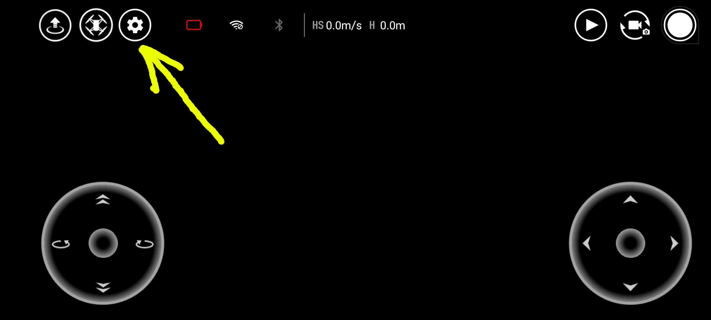

# Drone Facerec
[**Cleuton Sampaio**](https://github.com/cleuton), Março de 2020
My [**LinkedIn** profile](https://www.linkedin.com/in/cleutonsampaio/).


Uma demonstração de reconhecimento facial utilizando [**Keras**](https://keras.io/), [**ensorflow**](https://www.tensorflow.org/), python e o drone [**Tello**](https://store.dji.com/shop/tello-series), da **DJI**.

Este projeto é baseado em dois outros projetos do Github: 

1. [**FaceREC - CNN implementation of facial recognition**](https://github.com/cleuton/facerec_cnn), criado por [**mim**](https://github.com/cleuton);
2. [**EasyTello**](https://github.com/Virodroid/easyTello), criado por **Ezra Fielding**.

## Visão geral

Este software controla um drone Tello, capturando o vídeo streaming gerado por sua câmera de bordo. Ele intercepta cada frame e tenta reconecer rostos que aparecem na imagem, utilizando um modelo de rede [**Convolucional**](https://github.com/cleuton/FaceGuard/tree/master/CNN) que eu treinei, baseado em imagens do dataset  [**Labeled Faces in the Wild**](http://vis-www.cs.umass.edu/lfw/), e algumas fotos minhas. 

É uma prova de conceito do uso de inteligência artificial com drones e, por que não, de Internet das Coisas (IoT). Note que a performance pode ser baixa, afinal de contas, estou usando um laptop e um drone barato e simples. Com mais recursos, é possível obter melhor desempenho da solução.

## Antes de usar

Há algumas coisas que você precisa fazer antes de usar esta aplicação. Para começar, ela foi feita exclusivamente para o Drone Tello, mas se aplica a qualquer outro drone que possua uma API de programação python.

A primeira coisa a fazer é conseguir controlar seu drone usando apenas o [**easyTello**](https://github.com/Virodroid/easyTello) e depois tentar usar este projeto aqui. Por que? Bem, não é tão simples quanto parece...

Se você acabou de comprar seu drone Tello, precisa verificar qual é a versão do **Firmware** dele. Isso pode ser feito através da app [**Tello**](https://www.ryzerobotics.com/tello) (se não baixou, é melhor fazer logo).

Primeiramente, ligue o drone, conecte-se à rede WiFi dele com seu Smartphone (TELLO...), abra a app e clique no botão de configurações, como na imagem: 



Depois, clique em **More**: 


Clique no botão com três pontos: 


Agora, verifique o número da versão do firmware. Se estiver como 1.3 (alguma coisa), é preciso atualizar para 1.4!


O processo é feito em duas partes: Baixar o firmware para o Smartphone e atualizar no drone. Para baixar a nova versão do firmware, desconecte do WiFi do drone e conecte à Internet. Usando a app do Tello, clique no botão **Update** para baixar o firmware. Depois que baixar, conecte-se ao WiFi do drone e clique novamente no botão **Update**.

Depois do processo, verifique a nova versão do firmware. 

**Atenção**: Um indício que a API está desatualizada é quando o drone não reconhece o comando **streamon**!

Se você atualizou corretamente o firmware, eu recomendo que tente rodar o [**easyTello**](https://github.com/Virodroid/easyTello) original, seguindo as instruções no repositório dele. Com isso, você confirma que a API de controle está funcionando corretamente. Depois, pode baixar e rodar este repositório aqui. 

Isso feito, clone este repositório e crie um ambiente [**Anaconda**]() usando o script [**conta-env.yml**](./conda-env.yml): 

```
conda env create -f conda-env.yml
```

Ative o ambiente antes de usar este software: 

```
conda activate drone-facerec
```

## Controlando o drone

O script [**teste.py**](./teste.py) controla o drone. Ele faz basicamente 2 coisas: coloca em modo comando e inicia a captura de vídeo. Mas você pode fazer muito mais! Pode fazer o drone decolar, ir para a frente, ou virar e depois pousar. Há alguns comandos comentados que você pode usar. Se quiser saber mais sobre os comandos que o Tello aceita, [**veja na documentação**](https://dl-cdn.ryzerobotics.com/downloads/Tello/Tello%20SDK%202.0%20User%20Guide.pdf).

**Atenção**: Se você fizer o drone decolar, tenha certeza de haver espaço para isso! Se ele bater no teto ou nas paredes, pode ficar danificado! E cuidado ao tentar usar o Tello no ambiente externo (não recomendável). Se ele se afastar por mais de 10 metros, pode ficar fora do alcance do WiFi e colidir com alguma coisa. Teoricamente, se ele perder o contato, ele pousa automaticamente. 


