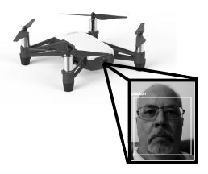
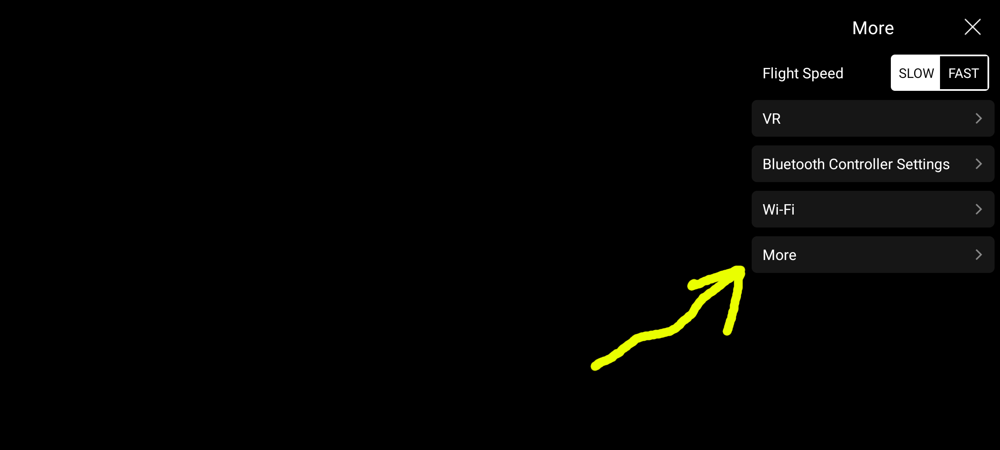

# Drone Facerec
[**Cleuton Sampaio**](https://github.com/cleuton), Março de 2020
My [**LinkedIn** profile](https://www.linkedin.com/in/cleutonsampaio/).



A facial recognition demonstration using [**Keras**](https://keras.io/), [**Tensorflow**](https://www.tensorflow.org/), python and the drone [**Tello**](https://store.dji.com/shop/tello-series), from **DJI**.

This project is based on two other Github projects:

1. [**FaceREC - CNN implementation of facial recognition**](https://github.com/cleuton/facerec_cnn), created by [**me**](https://github.com/cleuton);
2. [**EasyTello**](https://github.com/Virodroid/easyTello), created by **Ezra Fielding**.

## Overview

I ran this using **Ubuntu** (Linux). To run using **MS Windows** or **MacOS** some fixes must be done. Be my guest to convert it and submit a pull request!

This software controls a Tello drone, capturing the video streaming generated by its onboard camera. He intercepts each frame and tries to recognize faces that appear on the image, using a [**Convolutional Neural Network Model**](https://github.com/cleuton/FaceGuard/tree/master/CNN) that I trained, based on images from the dataset [**Labeled Faces in the Wild**](http://vis-www.cs.umass.edu/lfw/), and some pictures of mine.

It is a proof of concept of the use of artificial intelligence with drones and, why not, Internet of Things (IoT). Note that performance can be low, after all, I am using a laptop and a cheap and simple drone. With more resources, better performance of the solution is possible.

To use this solution, you will need:

1. A [**Tello** drone](https://store.dji.com/shop/tello-series), with Firmware 1.4 or higher;
2. A facial recognition model, generated by the project [**FaceRec_CNN**](https://github.com/cleuton/facerec_cnn);
3. The Dlib face prediction file: [shape_predictor_68_face_landmarks.dat](https://github.com/davisking/dlib-models) (see [FaceRec_CNN](https://github.com/cleuton/facerec_cnn));

I will teach you how to do these 3 things.

## Before using

There are a few things you need to do before using this application. First it was made exclusively for Drone Tello, but it applies to any other drone that has a python programming API.

The second thing to do is to be able to control your drone using only the original [**easyTello**](https://github.com/Virodroid/easyTello) project and then try to use this project here. Why? Well, it's not as simple as it looks ...

If you just bought your Tello drone, you need to check which version of **Firmware** it has. This can be done through the [**Tello**](https://www.ryzerobotics.com/tello) app (if you haven't downloaded it, it's better to do it now).

Then, turn on the drone, connect to his WiFi network with your Smartphone (TELLO ...), open the app and click on the settings button, as in the image:


Then, click on **More**: 



Click on the three dots button: 


Now, check the firmware version number. If it's 1.3... then you'll need to update it!


The process is done in two parts: Download the firmware to the Smartphone and update on the drone. To download the new firmware version, disconnect from the drone's WiFi and connect to the Internet. Using the Tello app, click the **Update** button to download the firmware. After downloading, connect to the drone's WiFi and click the **Update** button again.

After the process, check the new firmware version.

**Warning**: An indication that the API is out of date is when the drone does not recognize the command **streamon**!

If you have updated the firmware correctly, I recommend that you try to run the original [**easyTello**](https://github.com/Virodroid/easyTello) project, following the instructions in that repository. This confirms that the tracking API is working correctly. Then, you can download and run this repository here.

That done, clone this repository and create an [**Anaconda**](https://anaconda.org/) environment using the script [**conta-env.yml**](./ conda-env.yml):

```
conda env create -f conda-env.yml
```

Activate that environment before running this project:

```
conda activate drone-facerec
```

## Creating a model file

To do facial recognition, it is necessary to train a neural network. I didn't insert the original [**FaceREC_CNN**](https://github.com/cleuton/facerec_cnn) project here, not even the model file that I trained. I recommend that you clone the original project and train your own model, and then copy the **HDF5** file created to the **easyTello** folder, within this project.

Download and extract the [**shape_predictor_68_face_landmarks** file](http://dlib.net/files/shape_predictor_68_face_landmarks.dat.bz2), and place it in the FaceRec_CNN project and also inside the **easytello** folder for this project!

Generating a model is simple: 

1. **Get multiple photos of the same person's face**:
    1. Use [**Labeled Faces in the Wild**](http://vis-www.cs.umass.edu/lfw/) and download several photos of the same person, copying to the **raw** folder the FaceRec_CNN project;
    2. Name the files in this pattern: john-doe.nnnn.jpg (do not use spaces, number photos of the same subject, separating them with dots). For example: "bill-clinton.0001.jpg";
    3. Take several photos of your face (and whoever else you want to recognize) and save it in the **raw** folder following the same nomenclature as in step "1/2";
    4. Make sure that there is only one face on each training photo! If there is more than one face, crop the photo;
2. **Convert the photos**:
    1. The **trainCNN.py** script will rotate and crop the faces, transforming them into monochrome images. It will separate in training and test photos (folders "train" and "test") according to the variable **train_test_ratio = 0.3**. If it stays at 30%, then 70% of the images will be for training and the others for testing;
    2. Write down the categories found! The program will display a vector with the names found. Note to change in the prediction script (**predict.py**) and in the recognition script for this project [**faceprocessor.py**](./ easytello / faceprocessor.py);
    3. If there are 4 people in your **raw** folder, it has to separate 4 people in **train** and 4 people in **test**. With few images, fewer people can be in **test** and this will result in error.
3. **Get people's names and model file**:
    1. People's names are displayed on the console after training. Copy this vector and change it in **faceprocessor.py**;
    2. The model file will be named **'faces_saved.h5'** copy it to the **easytello** folder of this project;


Before trying with the real drone, I suggest that you run a local test using your webcam: 

```
ffmpeg -f video4linux2 -s 640x480 -r 15 -i /dev/video0 -vcodec libx264 -f  h264 -an udp://localhost:11111
```

Use the program that I included [**facetest_ffmpeg.py**](./ facetest_ffmpeg.py) to capture the images and do the recognition. If everything works, if he recognizes you, then everything is ready to run on the Drone.

If you want, you can run this project with FFMPEG:

```
python teste.py
```
 

## Controlling the drone

**Warning**: To do facial recognition, do not use the original Easytello project! I modified the project to communicate with my facial recognition script [**faceprocessor.py**](./ easytello / faceprocessor.py).

The [**teste.py**](./ teste.py) script controls the drone. It basically does 2 things: puts it in command mode and starts capturing video. But you can do so much more! You can make the drone take off, go forward, or turn around and then land. There are some commented commands that you can use. If you want to know more about the commands that Tello accepts, [**see the documentation**] (https://dl-cdn.ryzerobotics.com/downloads/Tello/Tello%20SDK%202.0%20User%20Guide.pdf) .

**Warning**: Do not try to connect your smartphone to the drone, as it only serves a single connection!

Make sure you have placed the file **h5** in the easyTello folder! Make sure the name is the same as it is in the [**faceprocessor.py**] file (./easytello/faceprocessor.py)

**Warning**: If you make the drone take off, make sure there is room for it! If it hits the ceiling or walls, it could be damaged! And be careful when trying to use Tello outdoors (not recommended). If he moves more than 10 meters, he may be out of range of WiFi and collide with something. Theoretically, if he loses contact, he lands automatically. 


